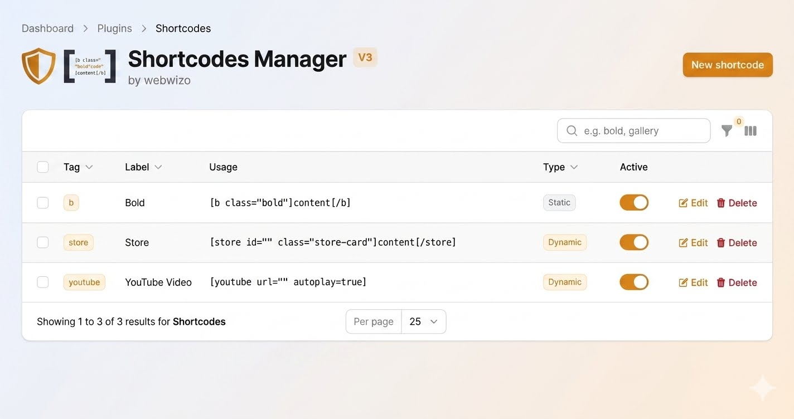

# Laravel Shortcodes — Filament Plugin

[](https://packagist.org/packages/webwizo/laravel-shortcodes-filament)
[](https://packagist.org/packages/webwizo/laravel-shortcodes-filament)
[](https://packagist.org/packages/webwizo/laravel-shortcodes-filament)



A [Filament v3](https://filamentphp.com) plugin that gives you a full admin UI for managing [webwizo/laravel-shortcodes](https://github.com/webwizo/laravel-shortcodes) — create, edit, and delete shortcodes from the browser without touching code.

Shortcodes are small tags like `[store id="5"]` that your content editors embed in any text field. This plugin stores them in the database and renders them dynamically at runtime, with optional live data pulled from any database table.

---

## Features

- **Full CRUD UI** — list, create, edit, and delete shortcodes from the Filament panel
- **Shortcode types** — choose between **Static** (attributes + template only) and **Dynamic** (adds a live DB data source)
- **Attribute builder** — define named attributes with defaults via a repeater UI
- **HTML template editor** — write the output HTML with `{{attr}}`, `{{content}}`, and `{{db.column}}` placeholders
- **Dynamic data sources** — pull a live database row into any shortcode template at render time, with soft-delete awareness
- **Usage example** — auto-generated, copyable shortcode string shown in the table and edit form
- **Annotated Facade** — full IDE autocompletion for `compile()`, `strip()`, and more via `Webwizo\ShortcodesFilament\Facades\Shortcode`
- **Multi-tenancy** — first-class Filament multi-tenant support with auto-detection of `int`, `UUID`, and `ULID` primary keys
- **Zero boilerplate** — shortcodes register themselves automatically on boot; no manual `Shortcode::register()` calls needed

---

## Requirements

| Dependency | Version |
|---|---|
| PHP | ^8.2 |
| Laravel | ^11.0 \| ^12.0 |
| Filament | ^3.0 |
| webwizo/laravel-shortcodes | ^1.0 |

---

## Installation

Install the package via Composer:

```bash
composer require webwizo/laravel-shortcodes-filament
```

Publish the config and migration:

```bash
php artisan vendor:publish --tag=shortcodes-filament-config
php artisan vendor:publish --tag=shortcodes-filament-migrations
php artisan migrate
```

Register the plugin in your Filament panel provider:

```php
use Webwizo\ShortcodesFilament\ShortcodesFilamentPlugin;

public function panel(Panel $panel): Panel
{
    return $panel
        ->plugins([
            ShortcodesFilamentPlugin::make(),
        ]);
}
```

---

## Usage

### Writing shortcodes in content

Once a shortcode is created in the panel, editors can embed it anywhere:

```
[store id="5"]Buy now[/store]

[hero class="dark" title="Welcome"]Homepage banner[/hero]
```

To render shortcodes in a Blade view, use the `webwizo/laravel-shortcodes` parser:

```blade
{!! Shortcode::compile($post->content) !!}
```

For full IDE autocompletion (`compile`, `strip`, `register`, etc.), import the facade provided by this package instead of the vendor one:

```php
use Webwizo\ShortcodesFilament\Facades\Shortcode;

// compile() now autocompletes in PhpStorm, VS Code + Intelephense, etc.
return Shortcode::compile($post->content);
```

---

### Creating a shortcode in the panel

1. Navigate to **Content → Shortcodes** in the sidebar
2. Click **New Shortcode**
3. Fill in:
   - **Tag** — the shortcode name used in content, e.g. `store` (lowercase, hyphens allowed)
   - **Label** — human-readable name shown in the panel
   - **Type** — `Static` for pure HTML/attribute templates, `Dynamic` to attach a live DB data source
   - **Attributes** — named parameters editors can pass, each with an optional default value
   - **Dynamic Data Source** *(Dynamic type only)* — pick the table, lookup column, and which shortcode attribute holds the lookup value
   - **Template** — the HTML output, using placeholders described below
4. Save — the shortcode is immediately live

---

### Template placeholders

| Placeholder | Replaced with |
|---|---|
| `{{content}}` | The inner content between opening and closing tags |
| `{{attr_name}}` | The value of a named attribute, falling back to its default |
| `{{db.column_name}}` | A column from the dynamic data source row |

**Example template:**

```html
<div class="store-card {{class}}">
    <h2>{{db.name}}</h2>
    <p>{{db.description}}</p>
    {{content}}
</div>
```

Used in content as:

```
[store id="5" class="featured"]Check it out[/store]
```

---

### Shortcode types

Every shortcode has a **Type**:

- **Static** — renders the HTML template with attribute and content substitution only. The Dynamic Data Source section is hidden.
- **Dynamic** — additionally pulls a live row from a database table at render time, making `{{db.column_name}}` placeholders available in the template.

### Dynamic data sources

Set the shortcode type to **Dynamic** and fill in the **Dynamic Data Source** section:

- **Database Table** — the table to query
- **Lookup Column** — the column used to find the row (e.g. `id`)
- **Shortcode Attribute** — which shortcode attribute holds the lookup value (e.g. `id`)

Then reference any column from that row in your template with `{{db.column_name}}`.

```html
<div class="store-card {{class}}">
    <strong>{{db.name}}</strong>
    <span>{{db.slug}}</span>
    {{content}}
</div>
```

Used in content as:

```
[store id="01kre0dee551yx52r6jwdambg6" class="featured"]Check it out[/store]
```

**Validation behaviour:**
- If the lookup attribute is missing from the tag (e.g. `[store]`), the shortcode renders nothing.
- If the lookup value does not match any row, the shortcode renders nothing.
- Soft-deleted rows (`deleted_at IS NOT NULL`) are automatically excluded.
- Any `{{db.*}}` placeholders with no matching column are silently removed.

Results are cached for 600 seconds by default (configurable via `cache_ttl`).

---

## Configuration

After publishing, edit `config/shortcodes-filament.php`:

```php
return [

    // Eloquent model used for shortcodes. Swap this to extend with your own model.
    'model' => \Webwizo\ShortcodesFilament\Models\Shortcode::class,

    // Database table name
    'table_name' => 'shortcodes',

    // Tables hidden from the Dynamic Data Source picker
    'excluded_tables' => [
        'migrations', 'failed_jobs', 'sessions', 'cache', /* ... */
    ],

    // Cache TTL in seconds for dynamic data source results. Set 0 to disable.
    'cache_ttl' => 600,

    'tenant' => [
        // Foreign key column on the shortcodes table
        'foreign_key'  => 'team_id',

        // Relationship method name on the Shortcode model
        'relationship' => 'team',

        // Your tenant Eloquent model class
        'model'        => \App\Models\Team::class,

        // Primary-key type: 'int', 'uuid', 'ulid', 'string', or null to auto-detect
        'key_type'     => null,
    ],

];
```

---

## Plugin fluent API

All options can also be set inline in the panel provider, which takes precedence over the config file:

```php
ShortcodesFilamentPlugin::make()
    ->navigationGroup('CMS')
    ->navigationIcon('heroicon-o-code-bracket')
    ->navigationSort(5)
    ->usingDynamicDataSources(true)
```

---

## Without multi-tenancy

If your app does not use Filament's multi-tenant system, simply leave `tenant.model` as `null` in the config (the default). The migration will create a clean `shortcodes` table with no foreign key column, and tags will be unique globally.

```php
'tenant' => [
    'model' => null, // no tenant column created in the migration
],
```

---

## Adding multi-tenancy later

If you installed the package without multi-tenancy and want to add it later, the original migration has already run so you cannot re-run it. Instead, update your config with the tenant model, foreign key, and relationship, then run the built-in command:

```bash
php artisan shortcodes:add-tenant
```

The command will:
- Read your `tenant.model`, `tenant.foreign_key`, and `tenant.key_type` from config
- Auto-detect the correct column type from your tenant model's traits if `key_type` is not set
- Check the column does not already exist
- Generate a new migration file in your `database/migrations` folder

Then apply it:

```bash
php artisan migrate
```

The generated migration adds the FK column, drops the global `UNIQUE(tag)` index, and replaces it with a tenant-scoped `UNIQUE(tenant_fk, tag)` so the same tag can exist independently per tenant.

---

## Multi-tenancy

The plugin has first-class support for Filament's [multi-tenancy](https://filamentphp.com/docs/3.x/panels/tenancy).

### Basic setup

Pass your tenant model and relationship details on the plugin:

```php
ShortcodesFilamentPlugin::make()
    ->scopedToTenant(true)
    ->tenantRelationship('team')       // method name on the Shortcode model
    ->tenantForeignKey('team_id')      // FK column on the shortcodes table
    ->tenantModel(\App\Models\Team::class)
```

### Tenant primary key types

The migration automatically uses the right column type for the foreign key based on your tenant model:

| Tenant key type | Column created |
|---|---|
| Auto-increment (`int`) | `UNSIGNED BIGINT` |
| UUID (`HasUuids`) | `UUID` (36 chars) |
| ULID (`HasUlids`) | `CHAR(26)` |
| Custom string | `VARCHAR` |

**Auto-detection** is on by default — the migration inspects `class_uses_recursive()` on your tenant model and picks the right column type. You can override it explicitly:

```php
// Via plugin fluent API
ShortcodesFilamentPlugin::make()
    ->tenantKeyType('ulid')

// Or via config
'tenant' => [
    'key_type' => 'ulid',
],
```

### Tenant model — required `hasMany` relationship

Filament's tenancy system requires your tenant model to declare a `hasMany` relationship back to the shortcodes table. Add this to your tenant model:

```php
use Illuminate\Database\Eloquent\Relations\HasMany;
use Webwizo\ShortcodesFilament\Models\Shortcode;

public function shortcodes(): HasMany
{
    return $this->hasMany(Shortcode::class, 'team_id');
}
```

> Replace `team_id` with whatever foreign key you configured. Without this relationship Filament will throw a "does not have a relationship" error when loading the panel.

### Full multi-tenant example

**1. Tenant model** (`app/Models/Team.php`):

```php
namespace App\Models;

use Illuminate\Database\Eloquent\Model;
use Illuminate\Database\Eloquent\Relations\HasMany;
use Webwizo\ShortcodesFilament\Models\Shortcode;

class Team extends Model
{
    // Required: Filament uses this to scope shortcodes to the current tenant
    public function shortcodes(): HasMany
    {
        return $this->hasMany(Shortcode::class, 'team_id');
    }
}
```

**2. Panel provider** (`app/Providers/Filament/AdminPanelProvider.php`):

```php
use App\Models\Team;
use Webwizo\ShortcodesFilament\ShortcodesFilamentPlugin;

public function panel(Panel $panel): Panel
{
    return $panel
        ->tenant(Team::class, slugAttribute: 'slug')
        ->plugins([
            ShortcodesFilamentPlugin::make()
                ->navigationGroup('Content')
                ->scopedToTenant(true)
                ->tenantRelationship('team')
                ->tenantForeignKey('team_id')
                ->tenantModel(Team::class),
        ]);
}
```

---

## Extending the model

You can swap in your own model by updating the config:

```php
// config/shortcodes-filament.php
'model' => \App\Models\Shortcode::class,
```

Your model should extend the package model to keep all functionality:

```php
namespace App\Models;

use Webwizo\ShortcodesFilament\Models\Shortcode as BaseShortcode;

class Shortcode extends BaseShortcode
{
    // Add your own methods, casts, relationships, etc.
}
```

---

## Changelog

Please see [CHANGELOG.md](CHANGELOG.md) for recent changes.

---

## Contributing

Pull requests are welcome. For major changes please open an issue first to discuss what you would like to change.

---

## ❤️ Support Open Source

This plugin is open source and built on top of [`webwizo/laravel-shortcodes`](https://github.com/webwizo/laravel-shortcodes).

If this plugin saves you development time or makes managing shortcodes easier for your team, consider supporting its continued development.

Your support helps me:

* 🛠️ Maintain and improve the plugin
* 🐛 Fix bugs and edge cases
* 🚀 Add new Filament and Laravel features
* 📚 Improve documentation and examples
* 🔧 Keep the package compatible with newer versions
* 💡 Build more useful open-source tools for Laravel developers

### ☕ Buy me a coffee

**[☕ Support the project →](https://buymeacoffee.com/webwizo)**

Even a small contribution helps me spend more time maintaining and improving open-source packages.

### ⭐ Other ways to help

You can also support the project without spending anything:

* ⭐ Star the repository
* 🐛 Report bugs
* 💡 Suggest features
* 🔧 Submit pull requests
* 📖 Improve documentation
* 📣 Share it with other Laravel / Filament developers

Thank you for using the plugin and supporting open source. ❤️

---

## License

The MIT License (MIT). Please see [LICENSE](LICENSE) for more information.

---

## Credits

- [Asif Iqbal](https://github.com/webwizo)
- Built on [webwizo/laravel-shortcodes](https://github.com/webwizo/laravel-shortcodes) and [Filament](https://filamentphp.com)
